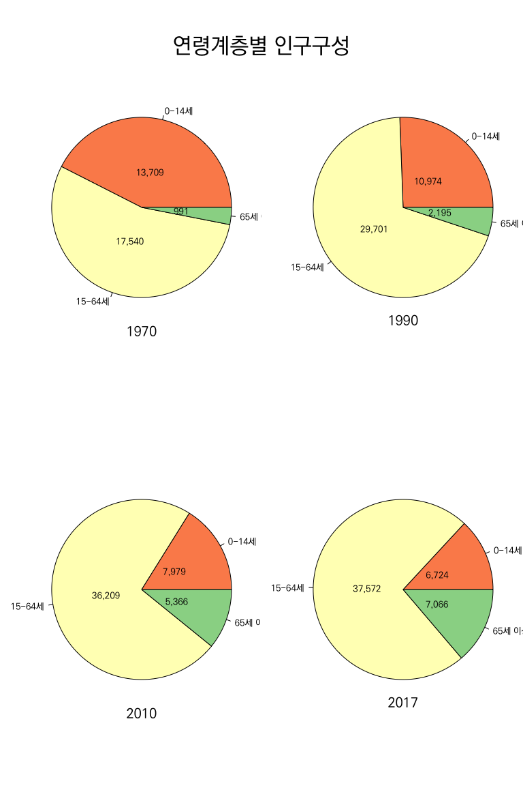
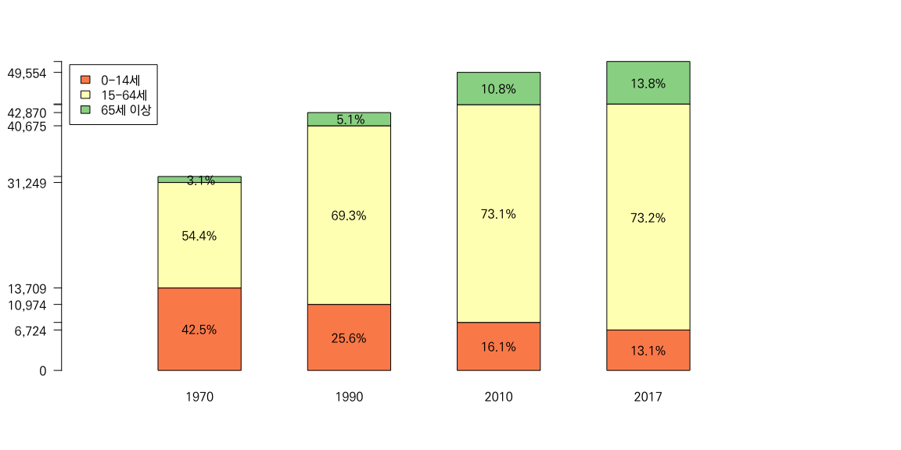

# Data


```r
library(knitr)
library(RColorBrewer)
library(magrittr)
col_pal <- brewer.pal(3, "Spectral")
age_dist <- matrix(c(13709, 17540, 991, 10974, 29701, 2195, 7979, 36209, 5366, 6724, 37572, 7066), 
                   nrow = 4, byrow = TRUE)
rownames(age_dist) <- c(1970, 1990, 2010, 2017)
colnames(age_dist) <- c("0-14세", "15-64세", "65세 이상")
age_dist
```

```
##      0-14세 15-64세 65세 이상
## 1970  13709   17540       991
## 1990  10974   29701      2195
## 2010   7979   36209      5366
## 2017   6724   37572      7066
```

# Text Coordinates 


```r
x_text <- age_dist %>%
  apply(MARGIN = 1, prop.table) %>%
#   apply(MARGIN = 2, . %>% {`-`(cumsum(.), `/`(., 2))}) %>%
  apply(MARGIN = 2, function(x) cumsum(x) - x / 2) %>%
  `*`(2 * pi) %>%
  cos %>%
  `*`(0.4)
y_text <- age_dist %>%
  apply(MARGIN = 1, prop.table) %>%
  apply(MARGIN = 2, function(x) cumsum(x) - x / 2) %>%
  `*`(2 * pi) %>%
  sin %>%
  `*`(0.4)
```

# Pie Charts


```r
#> 다음 `par`함수의 argument들이 설정되지 않았을 때 어떤 차이가 생기는지 유의
par(family = "KoPubWorldDotum Medium", mfrow = c(2, 2), oma = c(0, 0, 2.0, 0))
pie(age_dist[1, ], 
    radius = 1.0, 
    col = col_pal, 
    cex.sub = 1.5)
text(x_text[, 1], y_text[, 1], labels = format(age_dist[1, ], big.mark = ","))
title(sub = "1970", line = -2, cex.sub = 1.5)
pie(age_dist[2, ], 
    radius = 1.0, 
    col = col_pal, 
    cex.sub = 1.5)
text(x_text[, 2], y_text[, 2], labels = format(age_dist[2, ], big.mark = ","))
title(sub = "1990", line = -3, cex.sub = 1.5)
pie(age_dist[3, ], 
    radius = 1.0, 
    col = col_pal, 
    cex.sub = 1.5)
text(x_text[, 3], y_text[, 3], labels = format(age_dist[3, ], big.mark = ","))
title(sub = "2010", line = -2, cex.sub = 1.5)
pie(age_dist[4, ], 
    radius = 1.0, 
    col = col_pal, 
    cex.sub = 1.5)
text(x_text[, 4], y_text[, 4], labels = format(age_dist[4, ], big.mark = ","))
title(sub = "2017", line = -3, cex.sub = 1.5)
mtext("연령계층별 인구구성", 
      side = 3, 
      outer = TRUE, 
      cex = 2.0, 
      line = -3)
```

<!-- -->

```r
dev.copy(png, "../pics/demo7017_pie.png", width = 640, height = 960)
```

```
## quartz_off_screen 
##                 3
```

```r
dev.off()
```

```
## quartz_off_screen 
##                 2
```

# Bar Plot


```r
par(family = "KoPubWorldDotum Medium", mfrow = c(1, 1), oma = c(0, 0, 0, 0))
age_dist_p <- apply(age_dist, MARGIN = 1, prop.table) * 100
y_labels <- format(c(0, apply(age_dist, MARGIN = 1, FUN = cumsum)), big.mark = ",")
par(mfrow = c(1, 1))
# barplot(age_dist)
b <- barplot(t(age_dist), 
             names.arg = rownames(age_dist), 
             width = 1, 
             xlim = c(0, 9),
             space = 0.8,
             col = col_pal,
             axes = FALSE)
axis(side = 2, 
     at = c(0, apply(age_dist, MARGIN = 1, FUN = cumsum)), 
     labels = y_labels,
     las = 2)
y_text2 <- apply(age_dist, MARGIN = 1, FUN = function(x) cumsum(x) - x / 2)
text(rep(b, each = 3), y_text2, 
     labels = paste0(format(c(age_dist_p), digits = 1, nsmall = 1), "%"))
legend("topleft", 
       fill = col_pal, 
       legend = colnames(age_dist), 
       inset = 0.01)
```

<!-- -->

```r
dev.copy(png, "../pics/demo7017_bar.png", width = 960, height = 480)
```

```
## quartz_off_screen 
##                 3
```

```r
dev.off()
```

```
## quartz_off_screen 
##                 2
```

# Mosaic Plot


```r
par(family = "KoPubWorldDotum Medium")
mosaicplot(age_dist, 
           main = "Age Distribution", 
           color = col_pal, 
           cex.axis = 1, 
           las = 0)
```

<!-- -->

```r
dev.copy(png, "../pics/demo7017_mosaic.png", width = 480, height = 480)
```

```
## quartz_off_screen 
##                 3
```

```r
dev.off()
```

```
## quartz_off_screen 
##                 2
```
